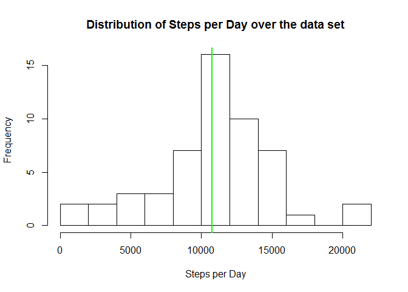
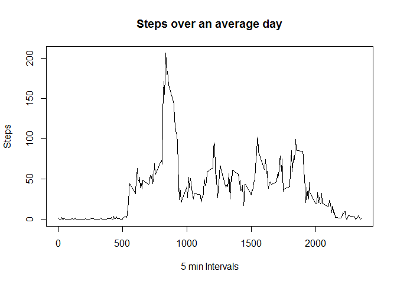
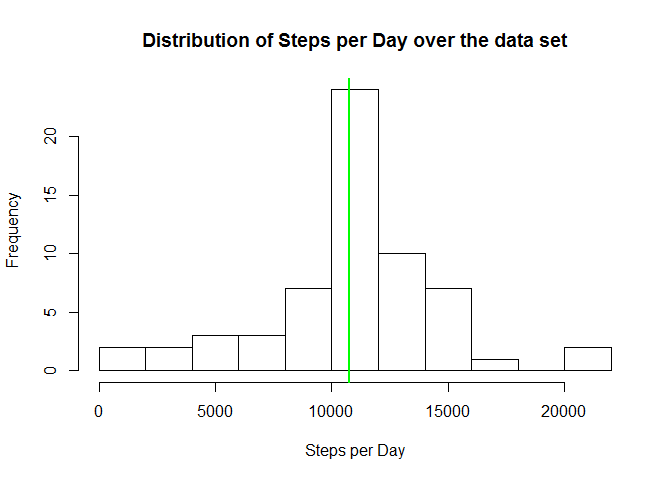
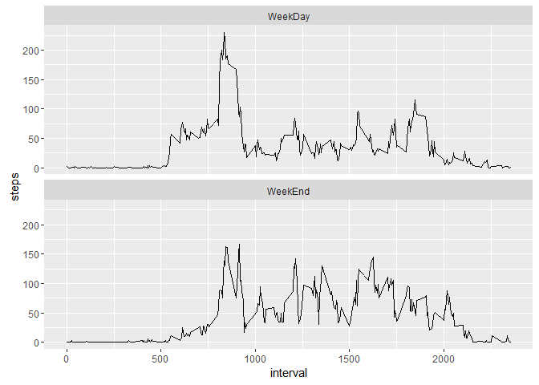

# Reproducible Research: Peer Assessment 1

The purpose of this script is to explore an activity dataset which gather the number of steps per day and per 5 minutes interval of a population. We will synthetise the dataset to first evaluate what is the distribution of the steps amongth the days (how much days with high count of steps, and days with low count of steps). Then we then will focus on the distribution of the activity within the day itself, to explore the influence of the time of the day on the activity. Finaly, we will compare the activity between week-end and the other day of the week. 


## Library
Above library are later used for data exploration and plot draw 


```r
library(dplyr)
library(ggplot2)
```

## Locals
Locals are set in engish to ensure that names of day are not in the computer native local format


```r
Sys.setlocale("LC_TIME", "English")
```

```
## [1] "English_United States.1252"
```

## Source of Data
Data are related to personal activity monitoring device. his device collects data at 5 minute intervals through out the day. The data consists of two months of data from an anonymous individual collected during the months of October and November, 2012 and include the number of steps taken in 5 minute intervals each day.


```r
download.file("https://d396qusza40orc.cloudfront.net/repdata%2Fdata%2Factivity.zip", "activity.zip")
unzip("activity.zip")
```

## Process of Data
Previous dataset has been unzip in "activity.csv" file. Dataset is recovered and dates are converted in date format for later use.


```r
dataActivity <-  read.csv("activity.csv", stringsAsFactors = FALSE, )
dataActivity$date <- as.Date(dataActivity$date, "%Y-%m-%d")
```

The dataset is formated with the following names

```r
names(dataActivity)
```

```
## [1] "steps"    "date"     "interval"
```

## What is mean total number of steps taken per day?

To explore the evolution of the steps count over the dates of the dataset, its group by date, and a summarize function extract the sum of the steps for each day. 


```r
stepsPerDay <-group_by(dataActivity, date) %>%
                summarize_all(sum)
```

The above summary gives details of the mean and median of the steps distribution. We can not that some of the data are missing and resulted in NA values (wich we will ignore at this stage)


```r
summary(stepsPerDay$steps)
```

```
##    Min. 1st Qu.  Median    Mean 3rd Qu.    Max.    NA's 
##      41    8841   10760   10770   13290   21190       8
```

We can then draw an histogram of the steps per day distribution over the data set. We also include the mean and median as vertical lines in the plot. Nevertheless, considering the summary, the two lines cannot be discriminated 
(the values being too close) 


```r
hist(stepsPerDay$steps, main="Distribution of Steps per Day over the data set",
                 xlab="Steps per Day", breaks=10)

abline(v = mean(stepsPerDay$steps, na.rm=T), lwd=2, col="red")
abline(v = median(stepsPerDay$steps, na.rm=T), lwd=2, col="green")
```

<!-- -->

## What is the average daily activity pattern?
Considering the previous histogram, we will now looks for the activity over the average day. For this purpose, the dataset is group by interval of 5 minutes (from 0 = 00H00, up to 2355 = 23H55).


```r
stepsPerInterval <-group_by(dataActivity, interval) %>%
                summarise(steps = mean(steps, na.rm=T))

plot(x=stepsPerInterval$interval, y=stepsPerInterval$steps, type="l", main="Steps over an average day", xlab="5 min Intervals", ylab="Steps")
```

<!-- -->

It is clear know that the number of steps is minimal during the night, and has a peak during the morning between 5H00 and 10H00

We can confirm this by returning the interval with the maximum steps count


```r
stepsPerInterval[which.max(stepsPerInterval$steps),]
```

```
## # A tibble: 1 × 2
##   interval    steps
##      <int>    <dbl>
## 1      835 206.1698
```

## Imputing missing values
We need now to identify the impact of the missing values in the dataset. A way to identify the influence of this missing elements in our calculation, is to impute values to replace the NA.

First the number of observation with a missing element can be computed

```r
sum(!complete.cases(dataActivity))
```

```
## [1] 2304
```

Mutate function of the dplyr package is used for replacing each NA value of steps for an interval, by the mean of the steps over this interval of the total dataset package. 

Note that the result is stored back in the dataframe

```r
dataActivity <- group_by(dataActivity, interval) %>% 
        mutate(steps = ifelse(is.na(steps), mean(steps, na.rm=T), steps)) %>%
        ungroup()
```

We can then group the dataset by date, gathering the sum of steps. The summary of the dataset gives an first look at the influence of the data cleaning.

```r
stepsPerDay <-group_by(dataActivity, date) %>%
                summarize_all(sum)
summary(stepsPerDay$steps)
```

```
##    Min. 1st Qu.  Median    Mean 3rd Qu.    Max. 
##      41    9819   10770   10770   12810   21190
```

Then the same histogram as the first chapter can be drawn. 

```r
hist(stepsPerDay$steps, main="Distribution of Steps per Day over the data set",
                 xlab="Steps per Day", breaks=10)

abline(v = mean(stepsPerDay$steps, na.rm=T), lwd=2, col="red")
abline(v = median(stepsPerDay$steps, na.rm=T), lwd=2, col="green")
```

<!-- -->

The impact compared to initial data frame is not noticeable. The median is now equal to the mean after a very slight move. The conclusion could be that the missing values have a very limited impact on the dataset and the exploration we can do. 

## Are there differences in activity patterns between weekdays and weekends?

The final exploration that can be done is to evaluate the influence of the weekday over the steps per interval curve. 

Mutate function of the dplyr package is used to add a new column to the dataframe after we have build group by interval. The new column will have "TRUE" for a week-end day, and "FALSE" for any other day.


```r
StepPerIntervalWkDay <- group_by(dataActivity, interval) %>% 
        mutate(wkday=weekdays(date) %in% c("Saturday", "Sunday"))
```

Resulting dataframe is transmitted to ggplot. stat\_summary is used to evaluate the mean of steps per interval, and facet_grid is used to split the data in two graph : one for the week-end, one for the week.


```r
ggplot(StepPerIntervalWkDay, aes(interval, steps)) + 
        stat_summary(fun.y = "mean", geom="line") + 
        facet_wrap(~wkday, labeller=as_labeller(c(`TRUE`="WeekEnd" , `FALSE`= "WeekDay")), nrow = 2)
```

<!-- -->


